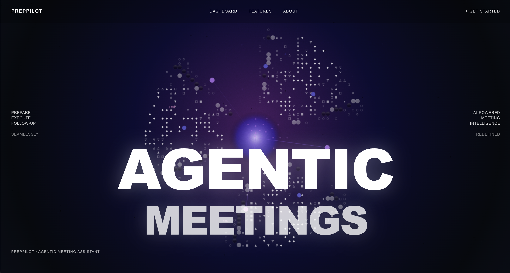
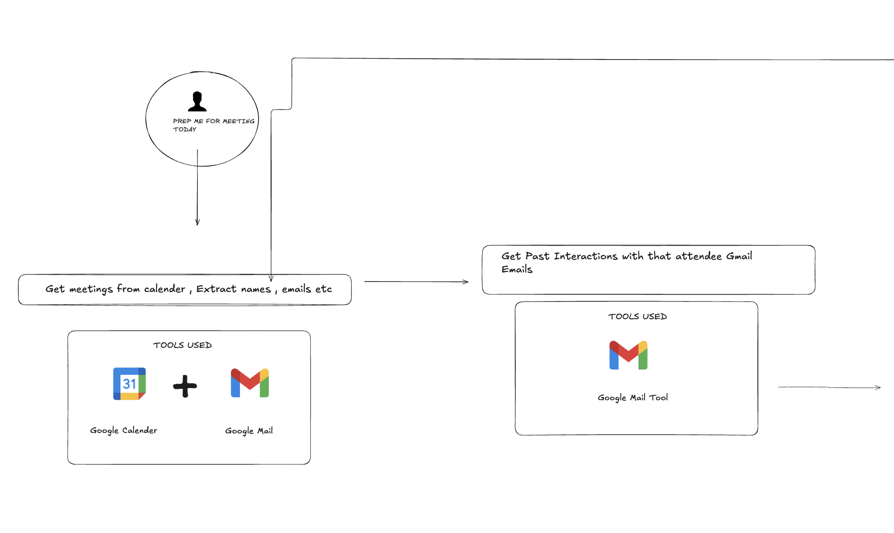
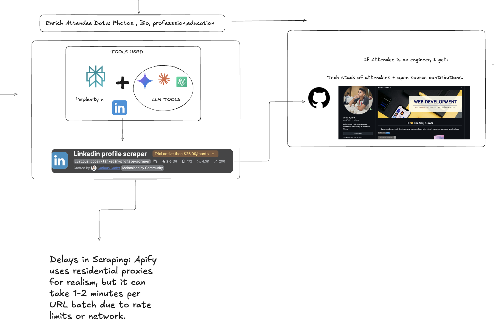
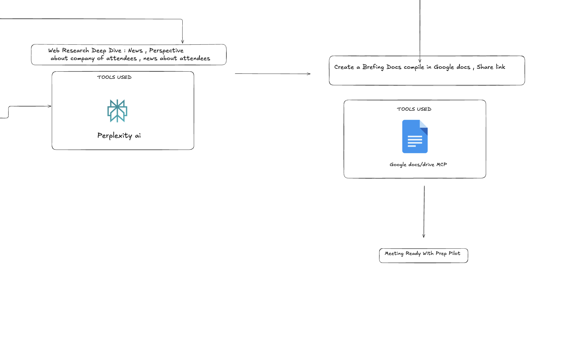

# PrepPilot - Meeting Preparation Tool

## THE PROBLEM

Meeting preparation is a time-consuming and often overlooked aspect of professional collaboration. When preparing for meetings with new attendees, professionals typically spend hours manually researching each person's background, skills, and recent work. This process involves:

- Manually searching LinkedIn profiles for each attendee
- Researching their work history, skills, and achievements
- Looking up their GitHub contributions and technical expertise
- Searching for recent news about their companies or projects
- Compiling all this information into a coherent document
- Formatting and sharing the preparation materials

This manual process is not only time-consuming but also prone to missing important details or failing to identify potential collaboration opportunities. Additionally, the information gathered is often scattered across multiple sources and not easily shareable with team members.

**The Solution**: PrepPilot automates this entire workflow by intelligently gathering, analyzing, and synthesizing attendee information from multiple sources to create comprehensive meeting preparation documents using portia-ai-sdk an agentic framework.

## Overview




PrepPilot is an intelligent meeting preparation system that automatically researches attendees, analyzes their professional backgrounds, and generates comprehensive meeting preparation documents. The system combines multiple data sources including LinkedIn profiles, GitHub contributions, and real-time web search to create detailed attendee profiles and meeting insights.

## Architecture

The system is built using FastAPI and consists of several specialized tools that work together to create a comprehensive meeting preparation workflow. Each tool is designed to handle a specific aspect of attendee research and document generation.

## COMPLETE FLOW:






## Tool Components

### 1. Meeting Data Extraction (`get_meeting_email.py`)

**Purpose**: Extracts meeting information and attendee details from email data using Portia's AI planning system.

**Key Features**:
- Processes email data to identify meeting attendees
- Extracts attendee names and email addresses
- Generates email summaries for each attendee
- Uses AI to structure and validate attendee information
- Handles edge cases like missing names by deriving them from email addresses

**Technical Implementation**:
- Uses Portia's PlanBuilderV2 for structured data extraction
- Implements Pydantic models for data validation
- Includes error handling for malformed data
- Supports both direct API calls and fallback mechanisms

**Output**: Structured JSON containing meeting title, organizer, and attendee list with email summaries.

### 2. Attendee Enrichment (`enrich_tools.py`)

**Purpose**: Enhances attendee data by researching their LinkedIn profiles and professional backgrounds.

**Key Features**:
- Generates targeted LinkedIn search queries for each attendee
- Extracts LinkedIn profile URLs from search results
- Fetches comprehensive profile data including work history, education, skills
- Handles multiple data formats and API responses
- Implements intelligent URL filtering and deduplication

**Technical Implementation**:
- Uses Portia's MCP (Model Context Protocol) for web search
- Integrates with Apify's LinkedIn scraper for profile data
- Implements robust error handling for failed enrichments
- Supports both synchronous and asynchronous processing

**Output**: Enriched attendee data with LinkedIn profile information, work history, skills, and professional background.

### 3. GitHub Profile Analysis (`githubProfileAnalsyer.py`)

**Purpose**: Analyzes GitHub profiles to understand technical skills, contributions, and project history.

**Key Features**:
- Fetches comprehensive GitHub profile data using Apify's scraper
- Analyzes pinned repositories and contribution patterns
- Extracts technical skills and programming languages
- Identifies open source contributions and project diversity
- Provides insights into coding activity and expertise areas

**Technical Implementation**:
- Uses Apify's GitHub profile scraper via MCP
- Implements username validation and URL construction
- Handles rate limiting and API errors gracefully
- Processes structured data into actionable insights

**Output**: Detailed GitHub analysis including tech stack, contributions, achievements, and activity patterns.

### 4. GitHub URL Extraction (`github_url_extractor.py`)

**Purpose**: Intelligently identifies and extracts GitHub URLs from attendee data.

**Key Features**:
- Scans attendee profiles for GitHub URLs
- Uses keyword matching to identify technical professionals
- Filters for relevant engineering and development roles
- Handles various URL formats and edge cases
- Provides fallback mechanisms for missing data

**Technical Implementation**:
- Uses regex patterns to identify GitHub URLs
- Implements keyword-based filtering for technical roles
- Handles both direct URLs and embedded links
- Supports multiple data structure formats

**Output**: List of valid GitHub URLs for further analysis.

### 5. Web Search Integration (`search_tool.py`)

**Purpose**: Provides real-time web search capabilities for additional context and information.

**Key Features**:
- Integrates with Perplexity API for intelligent web search
- Searches for company news, industry trends, and recent developments
- Provides context-aware search results
- Handles complex queries and returns structured data

**Technical Implementation**:
- Uses Perplexity's MCP server for search functionality
- Implements query processing and result parsing
- Handles API rate limiting and error responses
- Returns structured JSON responses

**Output**: Relevant search results and contextual information for meeting preparation.

### 6. Document Generation (`create_meet_summary.py`)

**Purpose**: Generates comprehensive meeting preparation documents from all collected data.

**Key Features**:
- Creates structured markdown documents
- Organizes information into logical sections
- Includes meeting overview, attendee profiles, and insights
- Provides conversation starters and discussion points
- Identifies collaboration opportunities

**Technical Implementation**:
- Uses OpenAI's GPT models for intelligent document generation
- Implements structured prompts for consistent formatting
- Handles large datasets and complex information
- Generates actionable insights and recommendations

**Output**: Comprehensive markdown document ready for meeting preparation.

### 7. Google Docs Integration (`google_docs_creation.py`)

**Purpose**: Converts markdown documents into formatted Google Docs for easy sharing and collaboration.

**Key Features**:
- Creates Google Docs with proper formatting
- Converts markdown headers to document styles
- Handles bullet points, tables, and text formatting
- Supports rich text and link preservation
- Provides direct sharing links

**Technical Implementation**:
- Uses Google Docs API for document creation
- Implements OAuth2 authentication flow
- Handles markdown-to-document conversion
- Manages document permissions and sharing

**Output**: Formatted Google Doc with meeting preparation content.

## API Endpoints

The system exposes several REST API endpoints for different functionalities:

- `GET /` - Health check and basic information
- `GET /get-meetings` - Retrieve meeting data for a specific date
- `POST /research-attendees` - Research and enrich attendee information
- `POST /analyze-github` - Analyze GitHub profiles for attendees
- `POST /generate-summary` - Generate meeting summary document
- `POST /search-information` - Search for additional context and information
- `POST /create-docs` - Create Google Doc from markdown content
- `POST /run-full-meeting-workflow` - Execute complete workflow end-to-end

## Data Flow

1. **Meeting Data Extraction**: System extracts attendee information from email data
2. **Attendee Enrichment**: LinkedIn profiles are researched and enriched with professional data
3. **GitHub Analysis**: Technical profiles are analyzed for skills and contributions
4. **Web Search**: Additional context is gathered through intelligent web search
5. **Document Generation**: All data is synthesized into comprehensive meeting preparation documents
6. **Document Export**: Final documents are formatted and exported to Google Docs

## Technical Requirements

- Python 3.13+
- OpenAi API for model
- FastAPI for API framework
- Portia SDK for AI planning and execution
- Google APIs for document creation
- Perplexity API for web search
- Apify for LinkedIn and GitHub data extraction
- OAuth2 authentication for Google services

## Reproduction Instructions

### Prerequisites

1. **Python 3.13+** installed on your system
2. **Git** for cloning the repository
3. **API Keys** (see API Keys section below)

### Step 1: Clone and Setup

```bash
# Clone the repository
git clone <repository-url>
cd portia-agent-examples/preppilot

# Create and activate virtual environment
python -m venv .venv
source .venv/bin/activate  # On Windows: .venv\Scripts\activate

# Install dependencies
pip install -r requirements.txt
```

### Step 2: Configure API Keys

Create a `.env` file in the `preppilot` directory with the following API keys:

```env
# Required API Keys
OPENAI_API_KEY=your_openai_api_key_here
PERPLEXITY_API_KEY=your_perplexity_api_key_here
APIFY_TOKEN=your_apify_token_here
PORTIA_API_KEY=your_portia_api_key_here
```


**Note**: For the hackathon evaluation period, I have included pre-configured LinkedIn cookies and Google credentials files to make reproduction easier for judges. These files will be removed after the hackathon winners are announced for security reasons.


### Step 3: Setup Google OAuth2

1. Go to [Google Cloud Console](https://console.cloud.google.com/)
2. Create a new project or select existing one
3. Enable Google Docs API
4. Create OAuth2 credentials
5. Download the `credentials.json` file
6. Place `credentials.json` in the `preppilot/combinedTools/` directory

### Step 4: Configure LinkedIn Cookies

The project includes pre-configured LinkedIn cookies in `combinedTools/linkedin_cookies.json`. These cookies are already set up for the demo and should work out of the box.
If not you can download cookie-editor extension to download cookie to allow the apify this actor to use those cookie as a json.


### Step 5: Run the Application

```bash
# Start the FastAPI server
uvicorn endpoints:app --reload --host 0.0.0.0 --port 8000
```

The server will start on `http://localhost:8000`

### Step 6: Test the Application

1. **Health Check**: Visit `http://localhost:8000/` to verify the server is running
2. **API Documentation**: Visit `http://localhost:8000/docs` for interactive API documentation
3. **Full Workflow Test**: Use the `/run-full-meeting-workflow` endpoint to test the complete pipeline

### Step 7: API Testing

You can test individual endpoints or run the full workflow:

```bash
# Test the full workflow (recommended for first run)
curl -X POST http://localhost:8000/run-full-meeting-workflow
```

## API Keys Required

### 1. OpenAI API Key
- **Purpose**: AI-powered document generation and text processing
- **How to get**: Sign up at [OpenAI Platform](https://platform.openai.com/)
- **Cost**: Pay-per-use, typically $0.01-0.10 per request

### 2. Perplexity API Key
- **Purpose**: Real-time web search for additional context
- **How to get**: Sign up at [Perplexity API](https://www.perplexity.ai/api)
- **Cost**: Free tier available, paid plans for higher usage

### 3. Apify Token
- **Purpose**: LinkedIn and GitHub data extraction
- **How to get**: Sign up at [Apify](https://apify.com/) and get your API token
- **Cost**: Free tier available, paid plans for higher usage

### 4. Portia API Key
- **Purpose**: AI planning and orchestration
- **How to get**: Sign up at [Portia AI](https://portialabs.ai/)
- **Cost**: Free tier available, paid plans for higher usage

### 5. Google OAuth2 Credentials
- **Purpose**: Google Docs integration
- **How to get**: 
  1. Go to [Google Cloud Console](https://console.cloud.google.com/)
  2. Create a new project
  3. Enable Google Docs API
  4. Create OAuth2 credentials

  5. Download credentials.json
- **Cost**: Free for personal use, quotas apply

**Note**: For the hackathon evaluation period, I have included pre-configured LinkedIn cookies and Google credentials files to make reproduction easier for judges. These files will be removed after the hackathon winners are announced for security reasons.

### Debug Mode

For detailed logging, run with debug mode:

```bash
uvicorn endpoints:app --reload --log-level debug
```


## Deployment

The system is deployed on platform Rendor which is on free tier pls wait 30s to cold start it first time.

This comprehensive toolset provides a complete solution for automated meeting preparation, combining multiple data sources and AI capabilities to create detailed, actionable meeting preparation documents.
